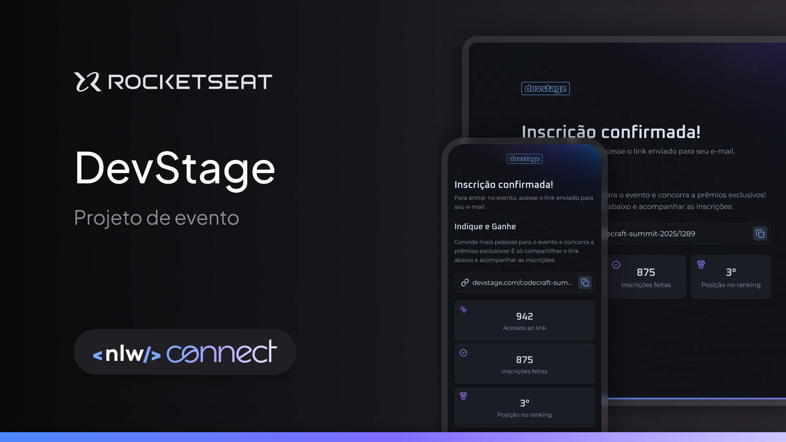

# DevStage

Projeto desenvolvido durante o NLW Connect da [Rocketseat](https://app.rocketseat.com.br/) que consiste em um site reponsivo de indicações para eventos.



## Índice

- [Ferramentas](#ferramentas)
- [Instalação](#instalação)
- [Funcionalidade](#funcionalidades)
- [Layout](#layout)
- [Licença](#licença)

## Ferramentas

- **React**: Biblioteca para construção da interface do usuário (`react` e `react-dom`).
- **Next.js**: Framework React para aplicações web renderizadas no servidor e estáticas (`next`).
- **React Hook Form**: Gerenciamento de formulários e validação de entrada (`react-hook-form`).
- **Zod**: Validação de dados com TypeScript (`zod`).
- **Tailwind CSS**: Framework CSS utilitário para estilização rápida (`tailwindcss`).

## Instalação

Siga as etapas abaixo para configurar e instalar o projeto em seu ambiente local:

1. Clone o repositório e acesse o diretório:

```bash
git clone git@github.com:brunohnsouza/nlw-connect-react.git
cd nlw-connect-react
```

2. Instale as dependências do projeto:

```bash
npm install
```

3. Configure e inicie a API:

Antes de continuar com a instalação do front-end, você precisa ter a API rodando localmente.

Para isso, siga as instruções disponíveis no repositório da API:

👉 [Repositório da API (Node.js)](https://github.com/brunohnsouza/nlw-connect-node)

Após configurar e iniciar a API, continue para o próximo passo.

4. Configure o `orval.config.ts`:

No arquivo `orval.config.ts`, atualize a propriedade `input` e `baseUrl` para apontar para o endpoint correto da API.

Se estiver rodando a API localmente, use algo como:

```
export default defineConfig({
  api: {
    input: 'http://localhost:3333/docs/json',
    output: {
      target: './src/http/api.ts',
      client: 'fetch',
      httpClient: 'fetch',
      clean: true,
      baseUrl: 'http://localhost:3333',

      override: {
        fetch: {
          includeHttpResponseReturnType: false,
        },
      },
    },
  },
})
```
5. Gere os clientes de API com o Orval:

```
npm run orval
```

6. Inicie o servidor em modo de desenvolvimento:

```
npm run dev
```

Acesse `http://localhost:3000` para visualizar a aplicação.

## Funcionalidades

O projeto oferece as seguintes funcionalidades:

- **Inscrição em Eventos**: Permite que usuários se inscrevam em eventos informando nome e e-mail.
- **Acesso ao Link de Convite**: Gera um link de convite exclusivo para compartilhar com outras pessoas.
- **Monitoramento de Cliques nos Convites**: Acompanhe quantas vezes o link de convite foi acessado.
- **Contagem de Convites Aceitos**: Veja quantos usuários se inscreveram usando um convite compartilhado.
- **Posição no Ranking**: Consulte a posição do usuário no ranking de indicações.
- **Visualização do Ranking Geral**: Exibe o ranking completo com a quantidade de convites aceitos por cada usuário.

## Demonstração

## Layout

[Figma](https://www.figma.com/community/file/1471119935944492720)

## Licença

[MIT](https://choosealicense.com/licenses/mit/)
